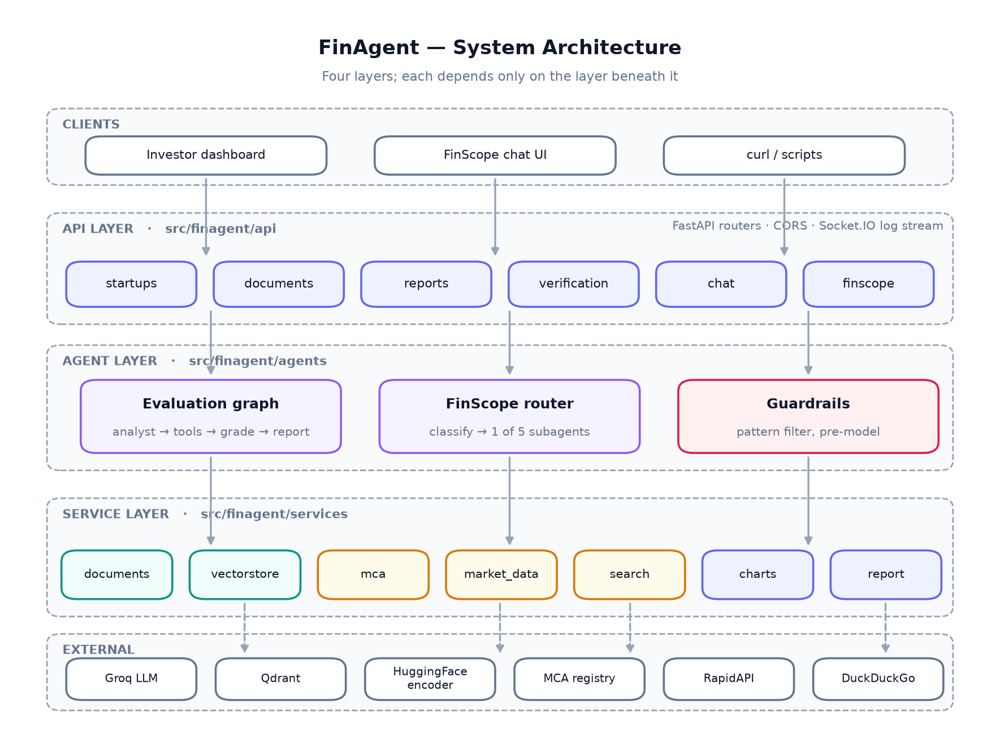

# FinAgent

FinAgent does two things. It runs an investor due-diligence pipeline that reads
a pitch deck, researches the market, checks the company against the corporate
registry, and produces a PDF report with charts. And it runs **FinScope**, an
advisory assistant that routes a question to one of five specialist subagents —
education, document analysis, market research, portfolio coaching, or live news.

Both are built on [LangGraph](https://langchain-ai.github.io/langgraph/), served
by FastAPI, and answer over one port.

---

## Why

Early-stage due diligence is expensive in exactly the place where money is
scarcest. Reading a deck, sizing a market, checking whether the company is even
registered, and writing it up takes an analyst the better part of a day — per
startup. Most angel investors and accelerator screening committees do not have
that analyst, so the first filter ends up being a founder's network rather than
the business.

The naive fix — hand the deck to a chatbot — fails in a specific and dangerous
way. A model asked to write a market analysis will write one whether or not it
has any evidence, and thin evidence produces the most confident prose. A report
that invents a TAM figure is worse than no report, because it looks like work.

FinAgent's answer is structural, not rhetorical:

- **A grader sits between retrieval and writing.** If the evidence is thin, the
  query is rewritten and searched again rather than passed forward. The loop is
  bounded, so an unsearchable company still gets a report — one that says the
  research was thin.
- **Claims are checked against a registry**, not just read back. A name that
  does not match the register, or a struck-off company, is flagged on the PDF.
- **Live data is fetched before the model is asked**, so the News Reporter
  summarises real articles instead of producing plausible ones.

---

## Architecture



Four layers, dependencies pointing one way: **API** (HTTP only) → **agents**
(graphs, prompts, guardrails) → **services** (documents, retrieval, registry,
charts, PDF) → **external**. Full walkthrough in
[docs/architecture.md](docs/architecture.md).

### The evaluation workflow


### The FinScope router


---

## Features

### Startup evaluation

- **Profile registry** with legacy-payload compatibility for older frontends.
- **Document ingestion** — Docling → PyPDF2 → pdfplumber, first usable result
  wins; chunked, embedded with `all-MiniLM-L6-v2`, indexed per startup in
  Qdrant.
- **Agentic research** — the analyst decides whether to search, a grader decides
  whether the evidence is sufficient, and a bounded rewrite loop tries again
  when it is not.
- **Registry verification** — CIN format validation, provider lookup, and
  consistency flags (`NAME_MISMATCH`, `COMPANY_STATUS_STRUCK_OFF`,
  `NO_DIRECTORS_FOUND`).
- **PDF reports** with a verification badge, three matplotlib charts (TAM/SAM/SOM,
  growth trend, six-dimension scorecard), and an 11-section written analysis.
- **Investor Q&A** grounded in the profile and documents, by ID or by name.

### FinScope advisory

- **Intent routing** with keyword fast-paths, then a model classifier.
- **Financial Educator** — explains concepts, and runs a real YouTube search
  when videos are asked for.
- **Document Analyzer** — `[FLASHCARD]` and `[COMPETITOR_CHART]` blocks the UI
  renders as widgets.
- **Portfolio Coach** — emits `[PORTFOLIO_FORM]` instead of advising without a
  risk profile.
- **News Reporter** — fetches live articles first, then summarises only those.
- **Guardrails** — a deterministic filter blocks instruction overrides,
  jailbreaks and harmful requests before any model call.
- **Live log streaming** over Socket.IO, so a long agent run is visible rather
  than opaque.

---

## Quickstart

```bash
git clone https://github.com/arav7781/FinAgent.git
cd FinAgent

cp .env.example .env        # add your GROQ_API_KEY
make install
make run                    # http://localhost:7860
```

In a second terminal, start the investment workspace:

```bash
make frontend-install
make frontend-run           # http://localhost:3000
```

The frontend reads `NEXT_PUBLIC_API_BASE_URL` (defaults to
`http://localhost:7860`) and connects to every REST endpoint plus the Socket.IO
agent progress stream.

Interactive API docs: `http://localhost:7860/docs`

Then run the end-to-end example:

```bash
python examples/01_evaluate_startup.py
# registers a startup → verifies it → runs the pipeline → saves evaluation_report.pdf
```

### Docker

```bash
docker compose up --build       # FinAgent + Next.js workspace + Qdrant
# or
docker build -t finagent . && docker run -p 7860:7860 --env-file .env finagent
```

### What you actually need

Only `GROQ_API_KEY`. Every other integration is optional and degrades on
purpose:

| Missing | Behaviour |
| :--- | :--- |
| `QDRANT_URL` | Document text is held in memory and passed to the agent directly. |
| `MCA_API_KEY` | A deterministic sandbox registry answers, so the verification flow stays demonstrable offline. |
| `RAPIDAPI_KEY` | The News Reporter works from model knowledge. |
| Web search down | The agent is told, and the report says the research was thin. |

`GET /health` reports which dependencies came up.

---

## API at a glance

| Endpoint | Method | Purpose |
| :--- | :--- | :--- |
| `/startups` | `POST` / `GET` | Register a startup · list all |
| `/startups/{id}` | `GET` / `PUT` | Read · update |
| `/startups/{id}/documents` | `POST` | Ingest a document from a URL |
| `/api/startups/{id}/documents/upload` | `POST` | Ingest an uploaded file |
| `/startups/{id}/verify/mca` | `POST` / `GET` | Verify by CIN · read status |
| `/reports/{id}` | `POST` | Run the pipeline, return the PDF |
| `/api/startups/{id}/analyze` | `POST` | Start a background analysis |
| `/api/startups/{id}/report/status` | `GET` | Poll it |
| `/chat/{id}` · `/chat/by-name/{name}` | `POST` | Investor Q&A |
| `/finscope/chat` | `POST` | Advisory chat |
| `/finscope/analyze-document` | `POST` | Document → flashcards |
| `/api/finance-news/headlines` | `GET` | Raw live headlines |
| `/health` | `GET` | Dependency readiness |

Full detail in [docs/api-reference.md](docs/api-reference.md).

---

## Repository layout

```
FinAgent/
├── src/finagent/          Application package
│   ├── api/routes/        FastAPI routers, one per resource
│   ├── agents/            LangGraph workflows, prompts, tools, guardrails
│   ├── services/          Documents, vectors, registry, market data, charts, PDF
│   ├── schemas.py         Request/response models
│   ├── settings.py        The only reader of os.environ
│   ├── store.py           In-memory repositories
│   └── app.py             Application assembly
├── tests/                 125 tests; no network, no keys
├── examples/              Runnable walkthroughs + curl recipes
├── dataset/               Synthetic startups, CINs, intent labels, guardrail probes
├── docs/                  Architecture, API, agents, deployment + diagrams
├── config/                Logging, defaults, scoring rubric
├── report/                The project report (PDF)
├── Dockerfile             docker-compose.yml · Makefile · requirements.txt
└── main.py                python main.py
```

---

## Development

```bash
make dev      # install dev dependencies
make test     # 125 tests
make lint     # ruff
make report   # regenerate diagrams + the project report PDF
```

The test suite runs without a Groq key, a vector database, or network access —
the model is stubbed and external services are exercised through their fallback
paths. See [docs/testing.md](docs/testing.md).

---

## Limitations

Stated plainly, because a tool that oversells itself is the problem this project
is trying to avoid:

- **State is in process memory.** It does not survive a restart, and the service
  does not scale past one process. `finagent.store` is the seam where a database
  goes.
- **The chart figures are illustrative baselines**, not model-derived estimates.
  The scorecard dimensions and weights live in `config/scoring_rubric.yaml`;
  wiring real scores means replacing one mapping in `services/charts.py`.
- **The written analysis is model-generated** and can be wrong. The PDF carries
  a disclaimer saying so.
- **There is no authentication and CORS is open.** Fine locally, not fine in
  public. See [docs/deployment.md](docs/deployment.md#before-exposing-this-publicly).
- **The registry provider is a sandbox by default.** Real verification needs an
  `MCA_API_KEY`.

---

## Project report

The assessed report — need analysis, technical functionality, architecture,
usage and scope, and impact — is at
[`report/FinAgent_Report.pdf`](report/FinAgent_Report.pdf), rebuilt with
`make report`.
`make dev`

---

## License

MIT — see [LICENSE](LICENSE).
