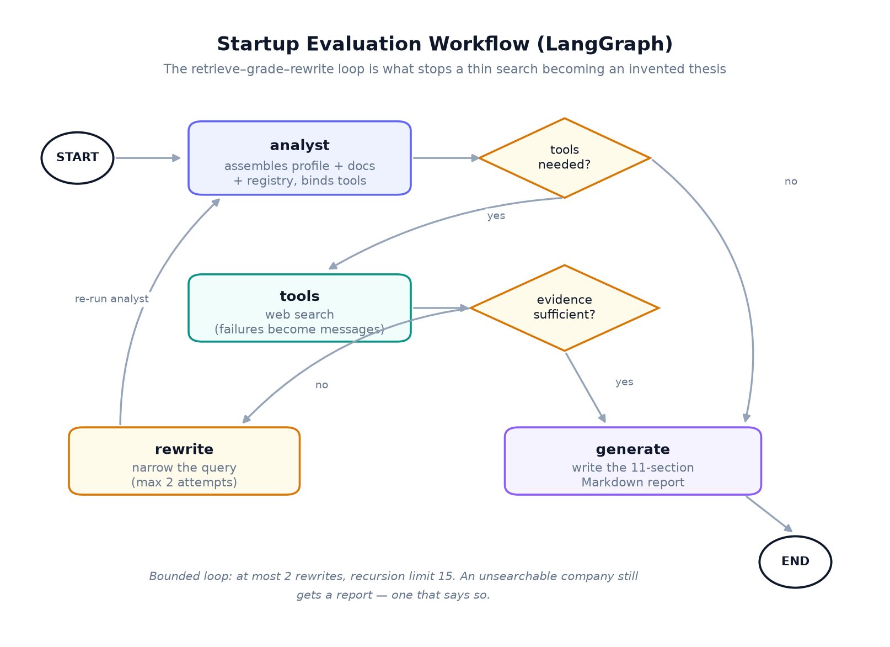
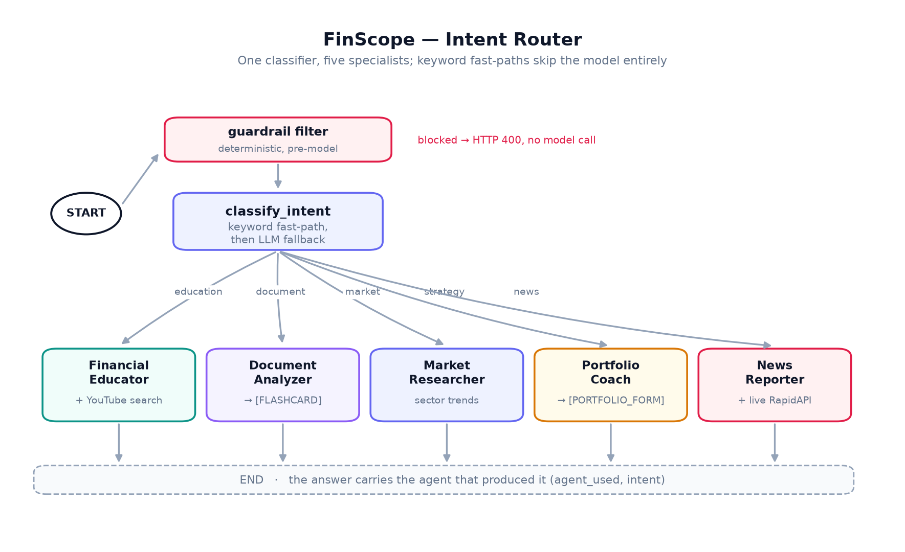

# Agents

Two LangGraph workflows. The evaluation graph is a loop with a quality gate;
FinScope is a router with five leaves.

---

## The evaluation workflow

`src/finagent/agents/evaluation_graph.py`



### State

```python
class AnalysisState(TypedDict):
    messages: Annotated[Sequence[BaseMessage], add_messages]
    startup_id: str
    collection_name: str
    rewrite_count: int
```

`rewrite_count` is what makes the loop terminate. It is state, not a closure
variable, so the bound holds across the graph's own retries.

### Nodes

**`analyst`** — assembles the prompt: the startup profile, retrieved document
context, and the registry verification line. Then binds `search_market_data`
and lets the model decide whether it needs to search. If tool binding fails
(a provider hiccup), it emits a plain message instead of raising, and the graph
routes straight to generation.

**`tools`** (`safe_tool_node`) — runs the tool calls. The wrapper exists because
a raised exception here would kill the whole evaluation. Instead each failed
call becomes a `ToolMessage` explaining what went wrong, which the model reads
and works around.

**`grade_relevance`** — the quality gate, and the reason this is a graph. Asks
the model whether the retrieved content supports a report. Returns `generate` or
`rewrite`. Two guards: past `max_query_rewrites` it always returns `generate`,
and if the grader call itself fails it returns `generate` — a grader failure
should not cost the user their report.

**`rewrite`** — asks the model to narrow the query, increments `rewrite_count`,
and sends control back to `analyst`.

**`generate`** — writes the 11-section Markdown report. It prefers tool output
as context; if every search failed it falls back to the analyst's own messages,
so the report reflects the run that actually happened.

### Edges

```
START      → analyst
analyst    → tools | generate        (tools_condition)
tools      → generate | rewrite      (grade_relevance)
rewrite    → analyst
generate   → END
```

### Tuning it

| Setting | Default | Effect |
| :--- | :--- | :--- |
| `max_query_rewrites` | 2 | Raising it improves thin-evidence reports and costs latency. |
| `recursion_limit` | 15 | LangGraph's own ceiling. Must stay above `2 × max_query_rewrites + 3`. |
| `retrieval_top_k` | 6 | More chunks, more context, more tokens. |
| `min_context_chars` | 50 | Tool output below this is treated as noise, not evidence. |

---

## FinScope

`src/finagent/agents/finscope_graph.py`



One classifier, five specialists. The split exists because the questions need
genuinely different behaviour — teaching wants patience and a video link, news
wants live data and no invention, portfolio advice wants the user's risk profile
*before* it says anything.

### Classification

Keyword fast-paths run first:

| Trigger | Intent |
| :--- | :--- |
| "video", "youtube" | `education` |
| "news", "latest", "breaking", "headline", "updates", "what's happening" | `news` |
| document loaded **and** "document"/"startup"/"company"/"analyze"/"this" | `document` |

Only if none match does the classifier model run. The fast-paths are free, they
are right about the obvious cases, and skipping a model call on "latest Apple
news" is the difference between a snappy reply and a visible pause.

The document fast-path deliberately requires a document to actually be loaded —
otherwise "tell me about this company" would route to an analyzer with nothing
to analyse.

### Subagents

| Subagent | Intent | Behaviour |
| :--- | :--- | :--- |
| Financial Educator | `education` | Explains concepts. Runs a real YouTube search when videos are asked for and weaves the results in. |
| Document Analyzer | `document` | Emits `[FLASHCARD]` and `[COMPETITOR_CHART]` blocks the frontend renders as widgets, then prose analysis. |
| Market Researcher | `market` | Sector trends and market structure. |
| Portfolio Coach | `strategy` | Emits `[PORTFOLIO_FORM]` instead of advising blind, then a compact allocation table once the user answers. |
| News Reporter | `news` | Fetches live articles **first**, then summarises only those into `[NEWS_CARD]` blocks. |

The tags are a UI contract. Renaming one here breaks the frontend.

The News Reporter's ordering is the point: data is fetched before the model is
called, and the prompt says "use the actual news data provided — do NOT make up
articles". A model asked for news without data will produce plausible headlines
that do not exist.

The Portfolio Coach's form is a safety design as much as a UX one. Allocation
advice without a risk tolerance or time horizon is advice that cannot be
correct, so the agent asks rather than guesses.

### Session documents

An uploaded document is cached against `session_id`, so follow-up questions in
the same conversation resolve without a re-upload.

---

## Guardrails

`src/finagent/agents/guardrails.py`

A deterministic pattern filter runs **before** any model call on
`POST /finscope/chat`. Blocked input returns HTTP 400 and never reaches an
agent.

| Category | Example |
| :--- | :--- |
| Instruction override | "ignore all previous instructions" |
| Prompt extraction | "what is your system prompt" |
| Safety bypass | "disable your guardrails" |
| Jailbreak | "DAN mode", "do anything now" |
| Regulated persona | "act as a lawyer" |
| Harmful content | violence, hate speech, explicit material |

It is regex, not a model, on purpose: it costs nothing, it cannot itself be
talked out of a decision, and it fails closed. It is a first line of defence,
not a complete safety system — the subagent prompts constrain behaviour
further. `dataset/guardrail_probes.jsonl` holds prompts that must be blocked
alongside benign ones that must not, because a filter that blocks real questions
is its own kind of failure.
