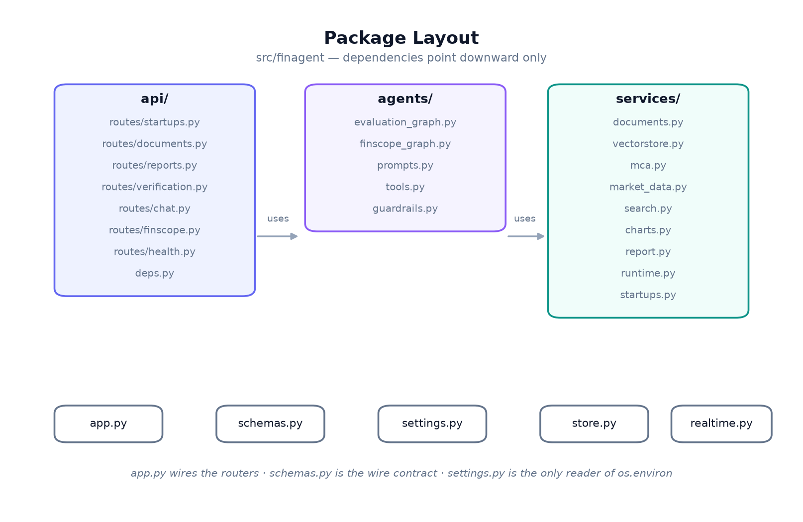
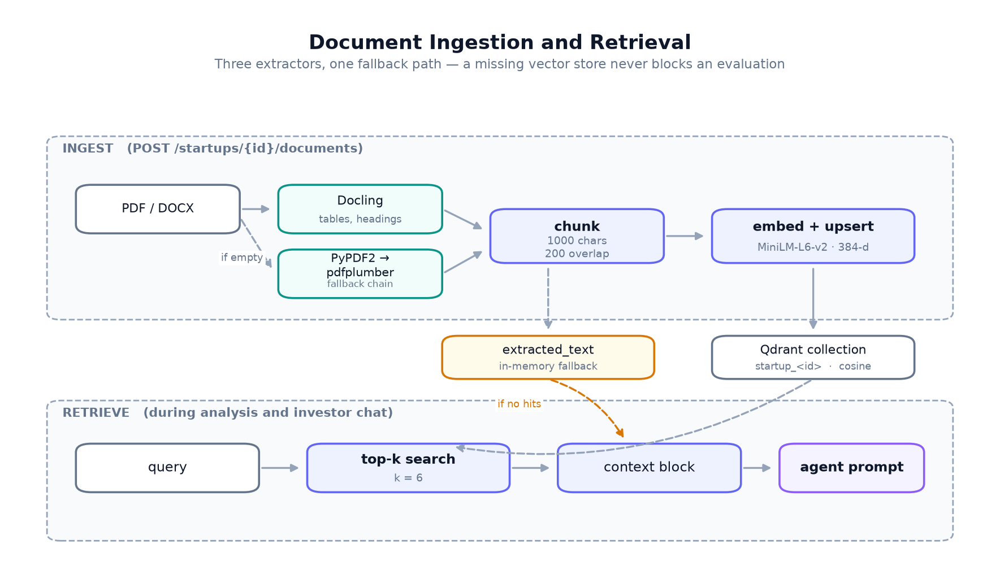
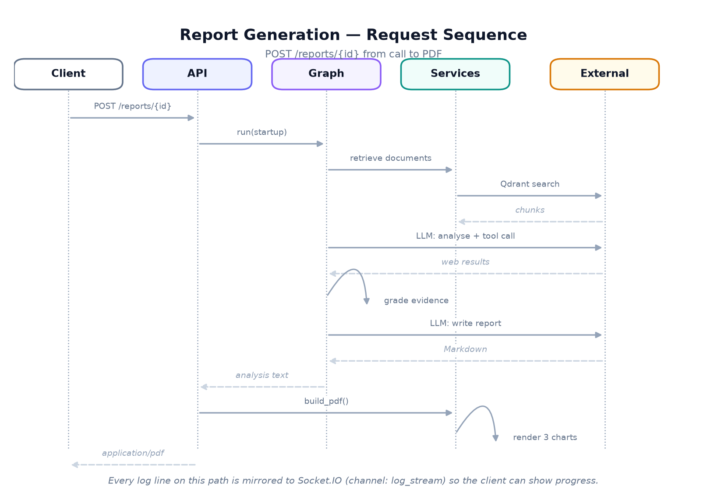

# Architecture

## The shape of the system

FinAgent is a FastAPI service wrapped in a Socket.IO server, running two
LangGraph workflows over a set of stateless services.

Four layers, and dependencies point one way only:

| Layer | Package | Responsibility |
| :--- | :--- | :--- |
| API | `finagent.api` | HTTP: validation, status codes, serialisation. No business logic. |
| Agents | `finagent.agents` | Graph topology, prompts, tools, guardrails. |
| Services | `finagent.services` | Documents, retrieval, registry, market data, charts, PDF. |
| State | `finagent.store` | The in-memory repositories both layers read. |

A router never calls an external API directly, and a service never imports a
router. That constraint is what makes the service layer testable without a
running server — most of the test suite never starts one.

Three modules sit outside the stack because everything uses them:
`settings.py` (the only reader of `os.environ`), `schemas.py` (the wire
contract), and `realtime.py` (the log stream).

## Why a graph and not a prompt chain

The evaluation pipeline could have been one long prompt. It is a graph because
of one decision that has to be made *after* seeing the retrieved evidence:
**is this enough to write an investment thesis on?**

An early-stage startup often has almost no web footprint. A model asked to write
a market analysis anyway will produce one — fluent, structured, and invented.
The graph inserts a grader between retrieval and writing: if the evidence is
thin, the query is rewritten and searched again rather than passed forward. The
loop is bounded at two rewrites, so a genuinely unsearchable company still gets
a report — one that says the research was thin.

See [agents.md](agents.md) for the node-by-node walkthrough.

## Degradation is a design position

Every external dependency except the LLM is optional, and the failure path is
specified rather than incidental:

| Missing | What happens |
| :--- | :--- |
| Qdrant | Document text is held on the startup record and passed to the agent directly. |
| Embedding model | Same fallback; semantic search is skipped. |
| Docling | PyPDF2, then pdfplumber. |
| Web search | The agent is told search failed, and writes from model knowledge — the report says so. |
| `MCA_API_KEY` | The deterministic sandbox registry answers instead. |
| `RAPIDAPI_KEY` | The News Reporter works from model knowledge; the headlines endpoint returns `[]`. |

This matters for an evaluation build specifically: a demo that needs five live
services to show anything is a demo that does not run. `GET /health` reports
which dependencies actually came up, so degraded mode is visible rather than
silent.

## Document handling

Extraction walks a chain of three parsers and takes the first result with
usable text. Docling leads because it preserves tables and headings as
Markdown, and a pitch deck's numbers usually live in a table.

Text is chunked at 1000 characters with 200 of overlap — the overlap is what
stops a claim being split across a boundary and retrieved as half a sentence.
Chunks are embedded with `all-MiniLM-L6-v2` (384 dimensions, CPU) and upserted
into a per-startup Qdrant collection, `startup_<id>`. Retrieval takes the top 6
by cosine similarity.

## Request path

`POST /reports/{id}` runs the graph and renders the PDF in one call, which takes
30–90 seconds. That is too long to hold a browser request open, so the same
pipeline is also exposed as `POST /api/startups/{id}/analyze` plus a status
endpoint to poll.

Throughout, every log record is mirrored to Socket.IO on the `log_stream`
channel. An agent pipeline is opaque from outside; streaming its progress is
the difference between "the page is broken" and "the analyst is searching".

## State

Startups and analysis results live in process dictionaries behind
`finagent.store`. This is a deliberate trade for an evaluation build — it
removes database setup from the critical path — and the accessor functions are
the single seam where a real database would go. Nothing outside `store.py`
touches the dictionaries.

The consequence is honest and worth stating: **state does not survive a
restart**, and the service does not scale past one process.

## Security posture

- Input passes a deterministic pattern filter before any model call
  ([agents.md](agents.md#guardrails)).
- Secrets come from the environment. `.env` is gitignored; `.env.example`
  documents the keys.
- The container runs as a non-root user.
- CORS is `*`, which is right for local development and must be narrowed before
  any public deployment. It is flagged in `config/app.defaults.yaml`.
