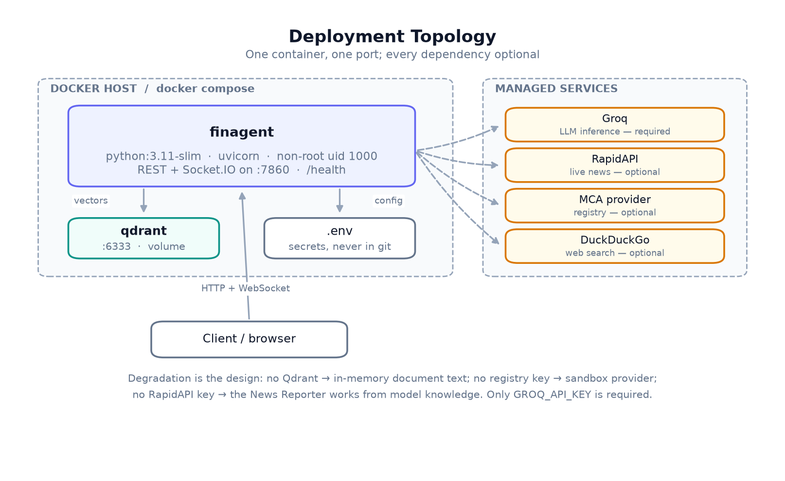

# Deployment



## Docker (recommended)

```bash
docker build -t finagent:latest .
docker run --rm -p 7860:7860 --env-file .env finagent:latest
```

The image is `python:3.11-slim`, runs as a non-root user (uid 1000), and
installs dependencies in a layer above the source copy so application edits do
not trigger a reinstall. A `HEALTHCHECK` polls `/health` with a 90-second start
period — the first boot downloads the embedding model.

## Docker Compose

Brings up FinAgent with a Qdrant instance and a persistent volume:

```bash
cp .env.example .env      # add GROQ_API_KEY
docker compose up --build
```

Compose sets `QDRANT_URL=http://qdrant:6333` for the app container. Dropping the
`qdrant` service still leaves a working API — retrieval falls back to in-memory
document text.

## Local

System libraries are needed for document conversion and chart rendering:

```bash
# macOS
brew install pkg-config gobject-introspection

# Debian / Ubuntu
sudo apt-get install build-essential python3-dev libglib2.0-0 libgl1
```

Then:

```bash
python -m venv .venv && source .venv/bin/activate
pip install -r requirements.txt
cp .env.example .env       # add GROQ_API_KEY
make run                   # or: python main.py
```

- API: `http://localhost:7860`
- Interactive docs: `http://localhost:7860/docs`

`make run` enables `--reload`. `python main.py` does not, and is closer to how
the container runs.

## First-boot cost

The first startup downloads `all-MiniLM-L6-v2` (~90 MB) to the system temp
directory. Expect 60–90 seconds. Subsequent boots are seconds — unless the temp
directory has been cleared, which containers do on every run. To avoid
re-downloading, mount a volume at the cache path
(`SENTENCE_TRANSFORMERS_HOME`, set in `settings.configure_hf_cache`).

## Before exposing this publicly

This build is written for local evaluation. Four things must change first:

1. **CORS is `*`.** Narrow `allow_origins` in `finagent.app.create_app` to your
   frontend's origin.
2. **There is no authentication.** Every endpoint is open. Put it behind a
   gateway or add an auth dependency.
3. **State is in process memory.** It is lost on restart and cannot be shared
   across replicas. Replace the `finagent.store` accessors with a database.
4. **There is no rate limiting.** Report generation is expensive; an open
   endpoint is an open invoice.

## Health and observability

`GET /health` reports each dependency separately, so degraded mode is visible:

```json
{"status": "healthy", "qdrant_connected": false, "llm_ready": true, ...}
```

`status` stays `healthy` when optional dependencies are down — that is the
design, not a bug. Watch the individual flags.

Logs go to stdout and are mirrored to Socket.IO on `log_stream`. In a container
runtime, collect stdout as usual.
